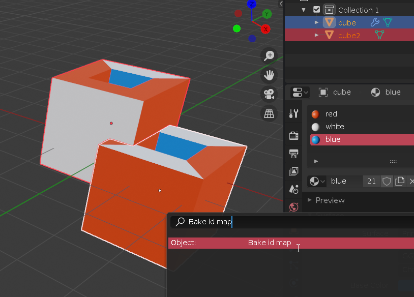

Single command id map baker for Blender. Bakes color of all selected object's materials to a single texture.

Blender 2.8's baking workflow overhaul has made baking id maps require much more clicks than before. This is intended to simplify this process by providing a single command.

### Usage

1. Meshes with assigned materials as ids (for example, but you could also use color textures as the source) should be prepared for baking: Make sure they are UV unwrapped and that the UV islands don't overlap, as you would with standard baking.

2. Select all objects you wish a signle id map to be baked for.

3. Search "Bake id map" in commands search bar and click on it.

And that's it! The texture will be created in the same folder as your blend file, with the name of ACTIVEOBJECTNAME_id.png.

You can additionally set a custom texture size, which will cause a rebake. 512 is default.

### What does it actually do?

1. It duplicates the source objects to use them as baking target objects,
2. Removes all materials from duplicates,
3. Applies modifiers and joins all duplicates which becomes the baking target mesh,
4. Adds a temporary baking material and assigns a baking texture node,
5. Creates the target texture,
6. Bakes the color from source objects to joined target mesh
7. Cleans up, deleting duplicated mesh and temporary materials and textures

As you can see, it does a bunch of stuff with a single command!

### Installation

Install like any other blender plugin: Edit > Preferences > Add-Ons > Install.. find bake_id_map.py. Then tick it to enable it.